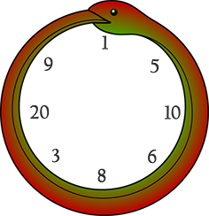

## 序列家族
序列可以理解为一系列有序的元素(数据)，通过序号我们可以找到对应的元素，序号即元素的位置也被称为索引，序列的开始索引是0，看下面这个例子：
    >>> nums = [1,5,10,6,8,3,20,9]
    >>> nums[0], nums[2]
    (1, 10)
    >>> nums[-1]
    95
    >>> nums[8]
    ...
    IndexError: list index out of range
    >>> nums[-9]
    ...
    IndexError: list index out of range
看下图中这条蛇找元素的时候我们可以从蛇头（0）开始向右正数，或者向左负数，比如“6”的索引可以是`3`也可以是`-5`。

注意代码中最后的那两个`IndexError`，不要让索引值超过蛇的长度，那样会咬到尾巴。